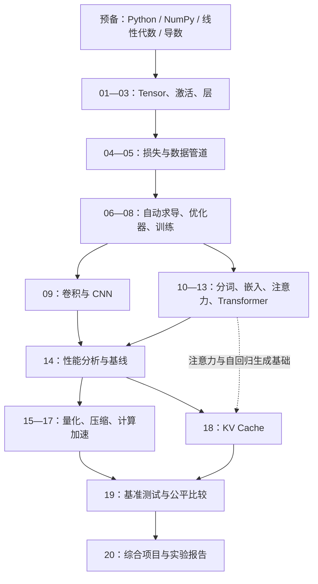

# TinyTorch 学习路线图

> 适用对象：希望通过阅读、实现和验证 TinyTorch，理解深度学习框架内部机制的学习者。  
> 对照版本：本地 `pyproject.toml` 中的 TinyTorch **0.1.13**；核对日期：**2026-09-15**。  
> 使用方式：从本文选择阶段，再进入对应 `src/NN_模块/README.md`，按照“核心知识 → 源码 → 实验 → 验收”推进。

## 1. 学完后要具备什么能力

最终目标是用 Python 与 NumPy 解释并搭建完整链路：**数据 → Tensor → 模型前向 → Loss → 自动求导 → 参数更新 → 训练评估 → 性能分析与优化**。

- **基础能力**：看到一段网络代码，能写出每一步的 shape、参数量和梯度方向。
- **框架能力**：能追踪 `Tensor`、计算图、层、优化器与训练循环之间的调用关系，定位“能运行但学不动”的原因。
- **模型能力**：能组装 MLP、CNN 与小型 GPT 风格模型，理解视觉与序列数据的差异。
- **系统能力**：能用实际测量说明瓶颈，比较量化、剪枝、向量化、融合与 KV Cache 的收益及代价。
- **交付能力**：能提交可复现的基线、优化结果、测试证据与实验结论。

官网的核心方法是 **Build → Use → Reflect（构建 → 使用 → 复盘）**。本地 `src` 已有大量参考实现，建议先自己推导，再读实现，最后用小实验检验理解。

## 2. 先认识本地目录

| 目录 / 文件 | 用途 | 学习时怎样使用 |
| --- | --- | --- |
| [`src`](../src/) | 按 `# %%` 分段的 Python 教材，含讲解、实现、单元测试和系统分析 | 主阅读入口；每个子目录新增的 `README.md` 是中文导读 |
| [`modules`](../modules/) | Jupyter Notebook 学习文件 | 使用官方 `tito module start / complete` 工作流时编辑这里 |
| [`tinytorch`](../tinytorch/) | 可导入的框架包，包含导出实现 | 外部测试、后续模块与里程碑会导入这里的代码 |
| [`tests`](../tests/) | 模块测试、集成测试、回归测试等 | 阅读测试中的输入、输出、边界条件与梯度检查 |
| [`milestones`](../milestones/) | 感知机、XOR、MLP、CNN、Transformer、优化实验 | 用完整任务验证模块之间是否配合正确 |
| [`tito`](../tito/) | CLI、导出与进度管理实现 | 命令行为不清楚时查这里 |
| [`doc/task1.md`](task1.md) | 已有的 Tensor → Activations → Layers 入门提纲 | 可继续作为前 3 个模块的速查笔记 |

**特别注意：修改 `src` 不会自动修改 `tinytorch`。** `python -m pytest tests/01_tensor/ -q` 主要验证导出包；不能只凭这个命令通过，就认定刚改的教材源码已经被验证。具体工作流见第 6 节。

## 3. 总路线与依赖关系

首次学习建议按 **01 → 20** 的编号顺序。下面是能力依赖示意，并非逐条 Python import 依赖图：



不支持 Mermaid 的阅读器可以直接看这条主线：

**数值基础（01–03）→ 训练闭环（04–08）→ 视觉（09）与语言（10–13）→ 测量（14）→ 优化（15–18）→ 评测（19）→ 综合项目（20）。**

第二遍可以按目标安排：训练框架重点复习 01–08；视觉重点复习 09；语言模型重点复习 10–13、18；系统优化重点复习 14–20。其中 18 要先理解注意力和逐 token 生成，不能只凭编号把它当成独立的通用缓存课。

## 4. 20 个模块导航与阶段成果

### 阶段 A：让网络能够计算和学习（01–08）

| 模块导读 | 最核心的问题 | 需要做出的成果 |
| --- | --- | --- |
| [01 Tensor](../src/01_tensor/README.md) | 数组怎样变成框架的统一数据结构？ | 解释 shape、广播、矩阵乘法、变形和归约；手算一个小例子 |
| [02 Activations](../src/02_activations/README.md) | 网络为什么需要非线性？ | 比较 Sigmoid、ReLU、Tanh、GELU、Softmax 的数值与梯度行为 |
| [03 Layers](../src/03_layers/README.md) | 怎样把运算和可训练参数封装成层？ | 追踪 `Linear`、`Sequential`、`Dropout`，算清参数量和训练/评估行为 |
| [04 Losses](../src/04_losses/README.md) | 怎么把预测误差变成可优化的标量？ | 分清 MSE、交叉熵、二元交叉熵的输入契约与数值稳定性 |
| [05 DataLoader](../src/05_dataloader/README.md) | 如何正确、可复现地提供训练批次？ | 解释 Dataset、迭代器、shuffle、尾批保留与数据增强 |
| [06 Autograd](../src/06_autograd/README.md) | 损失如何把梯度传回每个参数？ | 画计算图；理解反向遍历、广播梯度还原、累加和 `no_grad` |
| [07 Optimizers](../src/07_optimizers/README.md) | 梯度如何变成参数更新？ | 手算 SGD/动量/Adam 的一步更新，理解 AdamW 的权重衰减 |
| [08 Training](../src/08_training/README.md) | 如何把前面组件组成可靠训练流程？ | 跑通小数据训练，解释调度、梯度裁剪、评估和检查点 |

**阶段验收**：能解释为什么单层线性模型解决不了 XOR；能沿 `loss.backward()` 找到参数梯度；能记录训练损失、验证指标和参数变化，并排查梯度为空、忘记清零或模式错误。

### 阶段 B：处理图像和序列（09–13）

| 模块导读 | 最核心的问题 | 需要做出的成果 |
| --- | --- | --- |
| [09 Convolutions](../src/09_convolutions/README.md) | 如何利用图像的局部结构？ | 手算卷积输出尺寸，理解卷积/池化反向传播，追踪 `SimpleCNN` |
| [10 Tokenization](../src/10_tokenization/README.md) | 文本怎样变成离散 ID？ | 比较字符分词和 BPE，观察词表大小、序列长度与未知字符 |
| [11 Embeddings](../src/11_embeddings/README.md) | 离散 ID 如何获得可训练表示和位置信息？ | 解释查表、重复 ID 梯度累加、可学习/正弦位置表示 |
| [12 Attention](../src/12_attention/README.md) | 一个 token 如何读取其他 token 的信息？ | 手算缩放点积注意力，检查 mask 和多头张量维度 |
| [13 Transformers](../src/13_transformers/README.md) | 如何把注意力变成完整序列模型？ | 串联 LayerNorm、残差、MLP、GPT 前向与生成，检查因果性 |

**阶段验收**：能从图像 `(N,C,H,W)` 追到分类输出；能从 token `(B,T)` 追到 logits `(B,T,V)`；理解训练时并行处理序列与推理时逐 token 生成的不同。小型序列任务能验证模型结构，不以生成流畅文章作为本阶段必过条件。

### 阶段 C：理解并改善系统性能（14–19）

| 模块导读 | 最核心的问题 | 需要做出的成果 |
| --- | --- | --- |
| [14 Profiling](../src/14_profiling/README.md) | 时间和内存到底花在哪里？ | 记录参数量、FLOPs、延迟与内存，区分公式估计和实际测量 |
| [15 Quantization](../src/15_quantization/README.md) | 降低数值精度会改变什么？ | 理解 scale/zero point、校准和误差，比较存储与执行路径 |
| [16 Compression](../src/16_compression/README.md) | 怎样减少冗余参数或结构？ | 比较幅值剪枝、结构剪枝、低秩近似、知识蒸馏的限制 |
| [17 Acceleration](../src/17_acceleration/README.md) | 同样的计算如何更高效？ | 比较循环/向量化、融合、分块，检查数值一致性与计时条件 |
| [18 Memoization](../src/18_memoization/README.md) | 如何避免生成时重复计算历史 K/V？ | 检查缓存追加、位置偏移和重置；测量缓存的时间与空间代价 |
| [19 Benchmarking](../src/19_benchmarking/README.md) | 如何证明优化真实且比较公平？ | 统一输入与条件，重复测量，比较延迟、吞吐、精度和内存 |

**阶段验收**：先建立基线，再选一个瓶颈做单项优化；即使没有加速，也能解释原因。稀疏率、理论压缩比、FLOPs 降低不等于实测加速；教学中的能耗代理指标和 MLPerf 风格流程，也不等于硬件能耗实测或官方 MLPerf 认证。

本地代码有教学简化，阅读时应主动验证。例如：15 的量化层会反量化后做浮点矩阵乘法；16 的结构剪枝会清零权重而不实际缩小矩阵；17 的 `tiled_matmul` 当前直接调用 `np.matmul`；19 的部分评测存在模拟值回退。这些都在对应模块导读中说明。做综合实验时，要确认所用指标来自真实任务和实际执行路径。

### 阶段 D：把能力变成可复现实验（20）

进入 [20 Capstone](../src/20_capstone/README.md)，阅读本地 `SimpleMLP`、优化流水线、评测与 `BenchmarkReport`。先完成模块现有任务，再考虑扩展模型。

本地综合项目的示例优化主要通过调整 MLP 尺寸演示流程，不能据函数名称认定已经自动应用 15–18 的全部优化。其简化计时和内存估计还需要结合 19 的测量方法理解。

至少交付：

1. 一个明确任务与未优化基线：数据划分、模型结构、随机种子、环境和输入规模。
2. 至少两组实验：基线、单项优化；再做组合优化时说明顺序。
3. 同一条件下的质量指标、延迟分布、内存与模型存储结果，并标注测量口径。
4. 正确性证据：输出容差、梯度检查或适用的模块/集成测试结果。
5. 一页结论：哪里变好、哪里变差、证据是什么、下一步要验证什么。

## 5. 技能栈与建议节奏

### 先修知识：按需补齐

| 技能 | 入门前至少会什么 | 在哪里继续练 |
| --- | --- | --- |
| Python 3.10+ | 类、继承、函数、列表/字典、异常、导入与虚拟环境 | 01 的运算符方法；05 的迭代协议；06 的上下文管理器 |
| NumPy | `ndarray`、索引、shape、axis、广播、`matmul`、随机数 | 01–05、09、11–12、17 |
| 线性代数 | 向量、矩阵乘法、转置、内积、维度一致性 | 01、03、09、12；16 再补 SVD |
| 微积分 | 导数、偏导数、链式法则、梯度下降 | 02、04、06–08 |
| 概率与统计 | 概率分布、期望、均值/方差、对数 | 04 的交叉熵；10 的频次；19 的重复测量 |
| 工程习惯 | pytest、断言、日志、版本管理、固定种子 | 每个模块都保留一份实验记录 |
| 可选工具 | Jupyter/Jupytext、Matplotlib、性能计时工具 | Notebook 工作流、训练曲线和性能对比 |

如果 Python 或 NumPy 较陌生，先额外安排 **4–8 小时**：用二维小数组练习广播和矩阵乘法；写一个含 `__getitem__` / `__len__` 的类；用 pytest 写出正常、边界和错误输入三个检查。

首轮学习的计算基础是 NumPy；GPU、CUDA、分布式训练不是完成这 20 个模块的先修条件。

### 建议 16 周，每周约 4–5 小时

官网估计整体约 **60–80 小时**；下面是结合本地内容安排的建议，按验收结果调整，不必为了赶周数跳过梯度或 shape 问题。

| 周次 | 内容 | 建议投入 | 当周留下的产物 |
| --- | --- | --- | --- |
| 第 1–2 周 | 01–03 | 8–10 小时 | shape 推导表、激活比较、小网络前向计算 |
| 第 3–5 周 | 04–08 | 12–15 小时 | 一次手算反向传播、优化器更新表、XOR 训练记录 |
| 第 6 周 | 09 | 4–5 小时 | 卷积尺寸推导、CNN 与 MLP 对比 |
| 第 7–9 周 | 10–13 | 12–15 小时 | 分词对比、注意力手算、序列任务记录 |
| 第 10 周 | 14 | 3–4 小时 | 性能基线与瓶颈判断 |
| 第 11–13 周 | 15–18 | 12–15 小时 | 量化/压缩/加速/缓存的独立实验记录 |
| 第 14 周 | 19 | 3–4 小时 | 可复现的多指标对比表 |
| 第 15–16 周 | 20 | 8–10 小时 | 综合项目和报告 |

以上合计 **62–78 小时**，不含可选先修补课。每次学习建议用 20% 时间读原理，40% 追源码或实现，30% 做实验，10% 写复盘。

## 6. 本地阅读、修改与验证工作流

### 环境与命令约定

以下命令在本地项目根目录运行，示例采用 Windows PowerShell。本目录已有 `.venv`，可以直接使用其中的 Python，无需依赖终端默认解释器。

```powershell
# 进入学习项目根目录
Set-Location D:\tinytorch
# 确认使用项目内的 Python
.\.venv\Scripts\python.exe --version
# 查看当前版本实际支持的命令
.\.venv\Scripts\python.exe -m tito.main --help
```

各模块导读中的 `python -m pytest ...` 默认已激活项目虚拟环境。可先执行 `.\.venv\Scripts\Activate.ps1`；也可以将命令开头的 `python` 替换为 `.\.venv\Scripts\python.exe`。若只使用完整解释器路径，则无需激活。

### 只读源码，先建立理解

1. 先看模块 `README.md`，明确输入输出、先修和验收目标。
2. 看同目录 `.py` 中的 Learning Objectives、数学背景与实现。
3. 对每个关键方法写下：输入 shape、输出 shape、数据类型、是否创建计算图、是否改变状态。
4. 找紧邻的 `test_unit_*` 和对应 `tests/NN_模块/`，用小样本手算，再对照断言。
5. 最后看 Systems Analysis、`analyze_*` 或 `demo_*`，联系性能与工程约束。

### 在 Notebook 中完成练习

```powershell
# 打开 01 模块的 Notebook 学习流程
.\.venv\Scripts\python.exe -m tito.main module start 01
# 在 modules 中完成练习后，验证并导出到 tinytorch 包
.\.venv\Scripts\python.exe -m tito.main module complete 01
# 查看已记录的学习进度
.\.venv\Scripts\python.exe -m tito.main module status
```

本地 `module complete` 导出的是 **`modules` 里的 Notebook**，不会把刚改的 `src/*.py` 自动同步进去。完成标记也不能代替你对边界情况和端到端效果的理解。

### 直接修改 src 教材源码

如果选择在 `src/01_tensor/01_tensor.py` 中修改实现，数据流是：

**`src/*.py` → `modules/*.ipynb` → `tinytorch/*.py` → 外部测试与里程碑。**

本地 `tito dev export 01` 会重建该模块的 Notebook，**覆盖对应 Notebook 中已有的练习内容**。仅在以 `src` 为修改来源、并已保存需要保留的 Notebook 内容时执行；这是本地 CLI 明确的行为。

```powershell
# 从修改后的 01 源码重建 Notebook 与导出包
.\.venv\Scripts\python.exe -m tito.main dev export 01
# 验证当前导出包的 Tensor 模块
.\.venv\Scripts\python.exe -m pytest tests/01_tensor/ -q
```

本文只提供工作流说明；编写学习文档时没有执行上述导出、训练或完成进度命令。

### 测试该看哪一层

| 验证层 | 作用 | 示例 |
| --- | --- | --- |
| 教材内 `test_unit_*` | 解释关键方法应满足的局部性质 | 阅读源码中实现后的测试；整体运行教材还可能执行分析和演示 |
| 模块测试 | 验证导出 API、shape、数值与边界 | `python -m pytest tests/01_tensor/ -q` |
| 集成/回归测试 | 检查梯度、层和训练等模块交界处 | `python -m pytest tests/integration/test_integration_gradient_flow.py -q` |
| 历史里程碑 | 用完整任务验证能力 | 完成相应模块后运行第 7 节命令 |

本地 `tito module test 01` 包含源码内测、pytest 和集成检查等流程，比单独的 pytest 范围更广，但也不等同于自动导出。只改文档时无需重跑所有模型训练。

后续自己写核心方法时，遵守项目学习约定：**关键方法添加中文注释，注释覆盖率大于 50%**。优先解释 shape、公式、梯度和边界条件；覆盖率口径需在代码实践中保持一致。

## 7. 用历史里程碑检验成果

先运行 `.\.venv\Scripts\python.exe -m tito.main milestone list` 查看本地要求。下表命令省略共同前缀 `.\.venv\Scripts\python.exe -m tito.main`，模块编号和里程碑编号是两套编号。

| 完成模块 | 里程碑子命令 | 重点观察 |
| --- | --- | --- |
| 01–03 | `milestone run perceptron` | 感知机前向计算，尚不要求完整自动求导训练 |
| 01–03 | `milestone run xor` | 单层模型的表达能力限制 |
| 01–08 | `milestone run mlp --part 1` | 用隐藏层和反向传播解决 XOR |
| 01–08 | `milestone run mlp --part 2` | 将训练流程扩展到 TinyDigits |
| 01–09 | `milestone run cnn --part 1` | 离线 TinyDigits 的卷积模型；第 2 部分是需下载数据的 CIFAR-10 |
| 01–08、11–13 | `milestone run transformer` | 注意力处理序列反转任务；课程学习仍建议包含 10 分词 |
| 01–08、14–19 | `milestone run mlperf --part 1` | 模型压缩与优化评测 |
| 01–08、11–12、14、18 | `milestone run mlperf --part 2` | 生成时 KV Cache 的收益与行为 |

上述要求来自本地 [`MILESTONE_SCRIPTS`](../tito/commands/milestone.py)。本版本直接运行 `milestone run mlperf` 会涉及两个部分，整体要求还包含 **11、12**；不要只按官网概览的“01–08 + 14–19”判断完整命令是否可运行。性能倍率和准确率以自己的运行结果为准。

## 8. 每个模块通用的毕业标准

- [ ] 不看实现，能用 3–5 句话解释它解决的问题及输入输出。
- [ ] 能用一个足够小的例子手算关键结果，并标明 shape。
- [ ] 能定位关键实现、对应测试，以及它依赖的前置模块。
- [ ] 能解释至少一个边界情况或常见错误。
- [ ] 完成模块导读中的实验，留下结果而非只记录“看过”。
- [ ] 能说明当前实现的限制、内存/时间成本，以及下一模块为何需要它。

推荐每次复盘记录：**日期 / 模块 / 本次问题 / 实验输入 / 预测结果 / 实际结果 / 原因 / 下一步**。遇到训练失败，依次检查数据与标签、前向数值、损失契约、梯度流、参数更新和学习率；遇到性能问题，先固定测量口径再优化。

**第一次学习的具体起点**：打开 [01 Tensor 导读](../src/01_tensor/README.md)，先完成 shape、广播与矩阵乘法三项小实验，再进入已有的 [前三模块提纲](task1.md)。

## 9. 官方资料与本地依据

官网用于核对课程结构和学习方法；具体类名、API、导出路径和命令以本地代码为准。

- [TinyTorch 官网](https://mlsysbook.ai/tinytorch/)：课程目标与入口。
- [Getting Started](https://mlsysbook.ai/tinytorch/getting-started.html)：Build → Use → Reflect 工作流、20 模块与时间估计。
- [The Big Picture](https://mlsysbook.ai/tinytorch/big-picture.html)：能力之间的依赖与系统视角。
- [Module 01: Tensor](https://mlsysbook.ai/tinytorch/modules/01_tensor.html)：从首个模块开始，通过官网侧栏浏览后续讲解；各本地导读也附有对应官网链接。
- [Historical Milestones](https://mlsysbook.ai/tinytorch/milestones/index.html)：历史里程碑与课程成果。
- 本地依据：[`pyproject.toml`](../pyproject.toml)、[`README.md`](../README.md)、[`导出命令`](../tito/commands/dev/export.py)、[`模块工作流`](../tito/commands/module/workflow.py)、[`模块测试命令`](../tito/commands/module/test.py)、[`测试配置`](../tests/conftest.py)。
